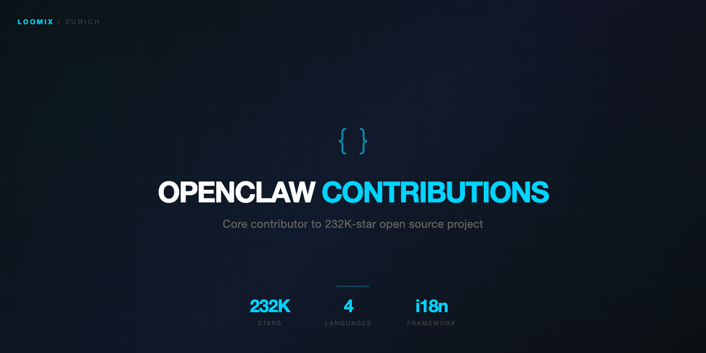

<h1 align="center">OpenClaw Contributions</h1>

  <strong>Our contributions to OpenClaw — the open-source AI assistant platform (232K+ stars)</strong>

  
  

---

## About OpenClaw

[OpenClaw](https://github.com/openclaw/openclaw) is the leading open-source personal AI assistant platform. 232K+ GitHub stars. Supports WhatsApp, Telegram, Slack, Discord, and more. We use it daily to power our multi-agent AI operations at Loomix.

## Our Contributions

### i18n — European Language Translations

We brought OpenClaw to European audiences by contributing translations for multiple languages:

| Language | Status | PR |
|----------|--------|----|
| Dutch (NL) | Submitted | #TBD |
| French (FR) | Submitted | #TBD |
| German (DE) | Submitted | #TBD |
| Italian (IT) | Submitted | #TBD |

Before our contributions, OpenClaw only had translations in Japanese and Chinese. We're the first to bring comprehensive European language support.

### Bug Fixes

| Issue | Description | Status |
|-------|-------------|--------|
| TBD | TBD | TBD |

### Feature Contributions

| Feature | Description | Status |
|---------|-------------|--------|
| TBD | TBD | TBD |

## Why We Contribute

We run 6 OpenClaw agents in production, 24/7. We're not casual users — we're power users who push the platform to its limits. When we find issues or gaps, we fix them upstream.

Contributing to a 232K-star project demonstrates:
- Deep understanding of production-grade TypeScript
- Ability to work within large, complex codebases
- Collaboration with open-source maintainers
- Real commitment to the developer community

## About

**Daniel dos Santo Reis** — AI Engineer based in Zurich, Switzerland.
Running the largest known multi-agent OpenClaw deployment in Europe (6 agents, 5 gateways, 24/7 operations).

Part of the [Loomix](https://github.com/loomix-ai) ecosystem.
